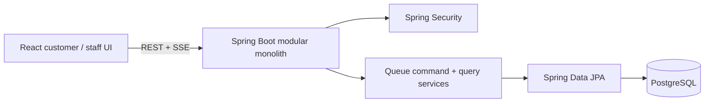

# LinePilot

LinePilot is a focused digital queue application for service desks. Customers join remotely, receive a daily token, track the line live, and cancel if plans change. Staff call the next token, start service, mark no-shows, complete work, and inspect paginated history.

Built by **Yashwardhan Verma** · [GitHub](https://github.com/YashwardhanV) · [LinkedIn](https://www.linkedin.com/in/yashwardhanv)

The project is intentionally a **modular monolith**: React + TypeScript + Tailwind, one Spring Boot API, and one PostgreSQL database. It demonstrates SDE-1 backend depth without pretending to be a distributed platform.

## Main features

- Public queue discovery, token creation, opaque tracking link, and cancellation.
- Explicit `WAITING → CALLED → SERVING → COMPLETED` lifecycle, plus `SKIPPED` and `CANCELLED`.
- Transactional daily token numbering with a database uniqueness constraint.
- Concurrent call-next safety using PostgreSQL `FOR UPDATE SKIP LOCKED`.
- Database-backed Spring Security accounts with `STAFF` and `ADMIN` roles.
- Live queue boards over Server-Sent Events (SSE).
- Moving-average wait estimate from the last ten completed service durations.
- Paginated queue history, validation, RFC 7807-style error responses, and OpenAPI UI.
- PostgreSQL Testcontainers integration tests, Docker Compose, health check, and GitHub Actions CI.

## Architecture



The database is the correctness boundary. `call-next` selects a waiting token with a row-locking query, changes its state, records the claiming staff member, and commits as one transaction. A partial unique index also prevents one staff account from holding two active claims. SSE snapshots are published only after commit.

More detail: [Architecture](docs/ARCHITECTURE.md) · [ER diagram](docs/ER_DIAGRAM.md)

## Run in under five minutes

Prerequisite: Docker Desktop or Docker Engine with Compose.

```bash
cp .env.example .env       # optional; defaults already work
docker compose up --build
```

Open:

- Application: [http://localhost:3000](http://localhost:3000)
- Staff dashboard: [http://localhost:3000/staff](http://localhost:3000/staff)
- Health: [http://localhost:3000/actuator/health](http://localhost:3000/actuator/health)
- OpenAPI UI: [http://localhost:8080/swagger-ui.html](http://localhost:8080/swagger-ui.html)

Demo staff accounts are `staff1` and `staff2`; both use password `demo123`. These are local demo credentials created only when `APP_DEMO_DATA=true`.

To stop:

```bash
docker compose down
```

Add `-v` only when you intentionally want to delete the local PostgreSQL volume.

## Local development

Start PostgreSQL, then run:

```bash
cd backend
mvn spring-boot:run
```

In another terminal:

```bash
cd frontend
npm install
npm run dev
```

Configuration is environment-driven. See [.env.example](.env.example) and `backend/src/main/resources/application.yml`.

## API examples

List queues:

```bash
curl http://localhost:3000/api/queues
```

Join a queue (replace `1` if needed):

```bash
curl -i -X POST http://localhost:3000/api/queues/1/tokens \
  -H "Content-Type: application/json" \
  -d '{"customerName":"Asha"}'
```

Call next as staff:

```bash
curl -u staff1:demo123 -X POST \
  http://localhost:3000/api/staff/queues/1/call-next
```

Queue events:

```bash
curl -N -H "Accept: text/event-stream" \
  http://localhost:3000/api/queues/1/events
```

OpenAPI describes all request/response schemas and endpoints.

## Tests

Backend tests require a running Docker engine because integration tests create real PostgreSQL with Testcontainers:

```bash
cd backend
mvn test
```

The suite covers business calculations, lifecycle rules, PostgreSQL constraints, REST validation, authentication/roles, cancellation, priority ordering, and simultaneous call-next requests.

Frontend:

```bash
cd frontend
npm ci
npm run lint
npm test
npm run build
npm audit --audit-level=moderate
```

## Important engineering decisions

- **SSE over WebSocket:** updates are one-way; SSE has reconnection support and a smaller protocol surface.
- **PostgreSQL lock over an in-memory mutex:** correctness must hold across request threads and is coupled to the database transaction.
- **Flyway over Hibernate schema creation:** migrations make constraints and indexes reviewable.
- **HTTP Basic for the local staff demo:** keeps authentication understandable and stateless. It must run behind HTTPS outside localhost; a secure cookie session is the likely next step.
- **No broker/cache/orchestrator:** Kafka, Redis, and Kubernetes do not solve a requirement in this version.

## Known limitations

- SSE subscribers live in memory, so the design intentionally supports one backend instance. A multi-instance version would need a shared event transport.
- Staff credentials use HTTP Basic. Production deployment requires HTTPS and should consider short-lived secure-cookie sessions.
- Anyone holding the unguessable public token UUID can view/cancel that token; there is no customer account or recovery flow.
- The admin queue-management API has no matching frontend page.
- No browser end-to-end test is included; API integration and component tests cover the critical paths.
- Wait estimates are simple moving averages and do not account for staff count, breaks, service type, or time of day.

## Future improvements

1. Idempotency keys for customer join requests.
2. Secure cookie-based staff sessions and rate limiting at the deployment edge.
3. Admin UI for queue configuration and authorized priority changes.
4. Browser end-to-end tests for customer and staff flows.
5. Optional notifications (email/SMS) only after delivery retries and credential management are designed.
6. A shared event channel only if a demonstrated need for multiple backend instances appears.

