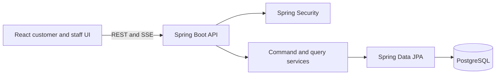

# LinePilot

## Project Architecture

**Project owner and maintainer:** Yashwardhan Verma  
**GitHub:** [YashwardhanV](https://github.com/YashwardhanV)  
**LinkedIn:** [yashwardhanv](https://www.linkedin.com/in/yashwardhanv)  
**Email:** [yashwardhanverma108@gmail.com](mailto:yashwardhanverma108@gmail.com)

LinePilot is a digital queue-management system built as a modular monolith. Customers can join a service queue, receive a daily token, follow live progress, and cancel their token. Staff can call the next customer, start service, mark a no-show, complete service, and review paginated history.



- **Frontend:** React, TypeScript, Vite, and Tailwind CSS provide separate customer and staff workflows. Nginx serves the production build and proxies API traffic.
- **Backend:** Java 21 and Spring Boot expose validated DTO-based REST endpoints. Controllers handle HTTP concerns, services own transactional use cases, repositories isolate persistence queries, and centralized exception handling returns structured problem responses.
- **Persistence:** PostgreSQL is the system-of-record and correctness boundary. Flyway owns schema evolution, while database constraints and indexes enforce queue invariants.
- **Concurrency:** A customer join transaction allocates a queue-and-day sequence number protected by a unique constraint. `call-next` uses `FOR UPDATE SKIP LOCKED` so concurrent staff requests claim different waiting tokens. A partial unique index prevents one staff account from holding multiple active claims.
- **Lifecycle:** Tokens move through `WAITING → CALLED → SERVING → COMPLETED`, with `SKIPPED` and `CANCELLED` terminal paths guarded by entity methods and service transactions.
- **Live updates:** Server-Sent Events publish queue snapshots after a successful transaction commit, preventing clients from observing rolled-back state.
- **Security and verification:** Database-backed `STAFF` and `ADMIN` accounts use Spring Security. PostgreSQL Testcontainers tests exercise real locking, constraints, authentication, and API behavior.

## How to Run

1. Install Docker Desktop or Docker Engine with Docker Compose.
2. From the repository root, optionally copy `.env.example` to `.env` to override the development defaults.
3. Build and start PostgreSQL, the backend, and the frontend:

   ```bash
   docker compose up --build
   ```

4. Open the application:

   - Customer UI: <http://localhost:3000>
   - Staff UI: <http://localhost:3000/staff>
   - Backend health: <http://localhost:8080/actuator/health>
   - OpenAPI UI: <http://localhost:8080/swagger-ui.html>

5. Sign in to the staff UI with `staff1` or `staff2`; both demo accounts use `demo123` when `APP_DEMO_DATA=true`.
6. Stop the stack without deleting the PostgreSQL volume:

   ```bash
   docker compose down
   ```

For local development, start PostgreSQL with `docker compose up -d db`, run `mvn spring-boot:run` from `backend`, then run `npm ci` and `npm run dev` from `frontend` in a second terminal.

Run the verification suites with:

```bash
cd backend
mvn test

cd ../frontend
npm ci
npm run lint
npm test
npm run build
```

Backend integration tests require a running Docker engine because they launch PostgreSQL through Testcontainers.

## Interview Prep

**Q: Why is LinePilot a modular monolith instead of a microservice system?**

**A:** The customer, staff, queue, and token workflows share one consistency boundary and have no measured need for independent deployment. A modular monolith keeps package ownership clear while allowing queue state changes, staff claims, and event publication to participate in understandable transactions. Services should be split only when scaling or team boundaries justify the operational cost.

**Q: How does `call-next` remain correct when two staff members act at the same time?**

**A:** The repository selects the next eligible token with PostgreSQL `FOR UPDATE SKIP LOCKED`. Each request locks a different row, updates the token and claiming staff member inside the same transaction, and relies on database constraints as a final guard. This works across request threads and application instances, unlike an in-memory mutex.

**Q: How are friendly daily token numbers generated without duplicates?**

**A:** Allocation occurs inside the join transaction and is scoped by queue and service date. A database uniqueness constraint protects the invariant under races. If concurrent requests contend, the database—not a prior `MAX + 1` read—decides whether the allocation is valid.

**Q: Why use Server-Sent Events instead of WebSockets or polling?**

**A:** Queue updates are one-way from server to browser, so SSE provides streaming, browser reconnection, and a smaller protocol surface than WebSockets. Events are emitted only after commit so a client never receives state that later rolls back. A shared event transport would be needed before running multiple backend instances.

**Q: How is the wait estimate calculated, and what is its limitation?**

**A:** The service uses a moving average of the latest completed service durations and combines it with the number of customers ahead. It adapts better than a fixed or all-time average, but it does not model staff count, service category, breaks, or time-of-day patterns.

**Q: What tests give confidence in the design?**

**A:** Unit tests cover calculations and state transitions, while Spring Boot integration tests run against real PostgreSQL through Testcontainers. The integration suite verifies constraints, authentication, REST validation, priority ordering, cancellation, and simultaneous `call-next` requests, which cannot be proven reliably with mocked repositories or an in-memory database.
