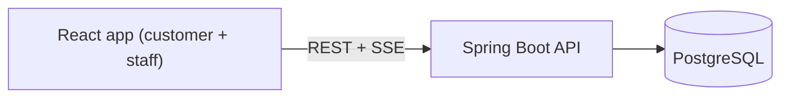

# LinePilot

LinePilot is a digital queue for service desks. Customers join remotely, get a daily token number (like `A-007`), watch the line move live, and can leave if their plans change. Staff call the next customer, start service, mark no-shows, complete service, and browse past tokens.

Built by **Yashwardhan Verma** · [GitHub](https://github.com/YashwardhanV) · [LinkedIn](https://www.linkedin.com/in/yashwardhanv)

**Stack:** Java 21 · Spring Boot 3 · PostgreSQL 16 · React 18 + TypeScript + Tailwind · Docker Compose

## Features

- Customers join a queue without an account and track their token from the same browser (a random ID kept in `localStorage`).
- Token lifecycle: `WAITING → CALLED → SERVING → COMPLETED`, plus `SKIPPED` (no-show) and `CANCELLED`.
- Two staff pressing **Call next** at the same moment always get different customers.
- Daily token numbers per queue (`A-001`, `A-002`, …) that never repeat, even under concurrent joins.
- Live queue board over Server-Sent Events (SSE).
- Wait estimate based on the last ten completed services.
- Staff sign-in with Spring Security, paginated history, and consistent JSON error responses.

## Architecture



One frontend, one backend, one database. The interesting part is inside the database transaction:

- **Call next** picks the oldest waiting token with `SELECT … FOR UPDATE SKIP LOCKED`, so two staff members can never claim the same token.
- **Join queue** locks the queue's row while it increments the daily counter, so two customers never get the same number. A unique constraint backs this up.
- A partial unique index allows each staff member only one active (`CALLED`/`SERVING`) token.
- Live boards are notified only after the change has been committed.

More detail: [Architecture](docs/ARCHITECTURE.md) · [Database](docs/ER_DIAGRAM.md)

## Run it

Prerequisite: Docker with Compose.

```bash
cp .env.example .env       # optional; defaults work
docker compose up --build
```

- App: <http://localhost:3000>
- Staff dashboard: <http://localhost:3000/staff> (log in as `staff1` or `staff2`, password `demo123`)
- API docs (Swagger UI): <http://localhost:8080/swagger-ui.html>

Stop with `docker compose down`. Add `-v` to also delete the database volume (needed if you ran an older version of the schema).

## Local development

Start PostgreSQL, then:

```bash
cd backend && mvn spring-boot:run
```

```bash
cd frontend && npm install && npm run dev   # http://localhost:5173
```

Configuration comes from environment variables; see [.env.example](.env.example) and `backend/src/main/resources/application.yml`.

## API examples

```bash
# list queues
curl http://localhost:3000/api/queues

# join queue 1
curl -i -X POST http://localhost:3000/api/queues/1/tokens \
  -H "Content-Type: application/json" -d '{"customerName":"Asha"}'

# staff: call the next customer
curl -u staff1:demo123 -X POST http://localhost:3000/api/staff/queues/1/call-next

# live updates
curl -N http://localhost:3000/api/queues/1/events
```

## Tests

Backend integration tests use Testcontainers, so Docker must be running:

```bash
cd backend && mvn test
```

They cover the token lifecycle, wait-time maths, the database constraints, REST validation and authentication, first-come-first-served ordering, cancellation, and two staff calling next at the same time against a real PostgreSQL.

```bash
cd frontend && npm ci && npm run lint && npm test && npm run build
```

## Design decisions

- **SSE instead of WebSocket:** updates only flow from server to browser, and the browser's `EventSource` reconnects by itself.
- **Database lock instead of a Java lock:** `synchronized` only protects one JVM and isn't tied to the transaction; the database row lock is.
- **Flyway instead of auto-generated schema:** constraints and indexes are written down and reviewable.
- **HTTP Basic for staff:** simple and stateless for a demo; it must run behind HTTPS outside localhost.
- **No Redis, Kafka or Kubernetes:** nothing in this app needs them.

## Known limitations

- SSE subscribers are kept in memory, so only one backend instance is supported.
- Anyone with a token's tracking link can view or cancel that token; customers have no accounts.
- Queues are created by seed data; there is no admin screen.
- Wait estimates are a simple average and ignore staff count, breaks and time of day.
- No browser end-to-end tests yet.

## Next steps

1. Browser end-to-end test of the customer and staff flows (Playwright).
2. Session-cookie login for staff instead of HTTP Basic.
3. Idempotency key on "join queue" so a double-submit can't create two tokens.
4. Admin screen for creating and closing queues.
