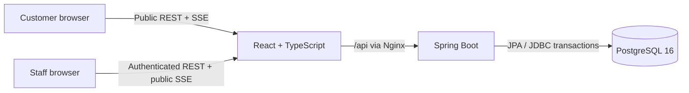
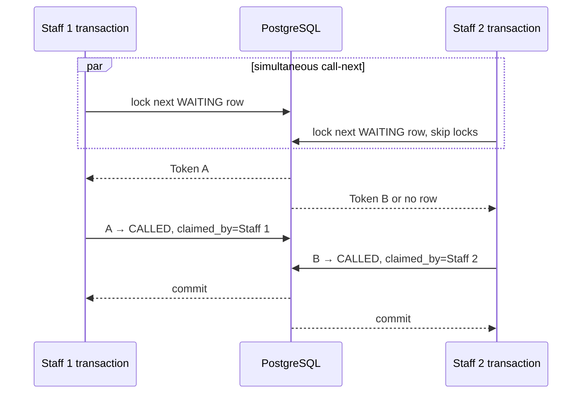
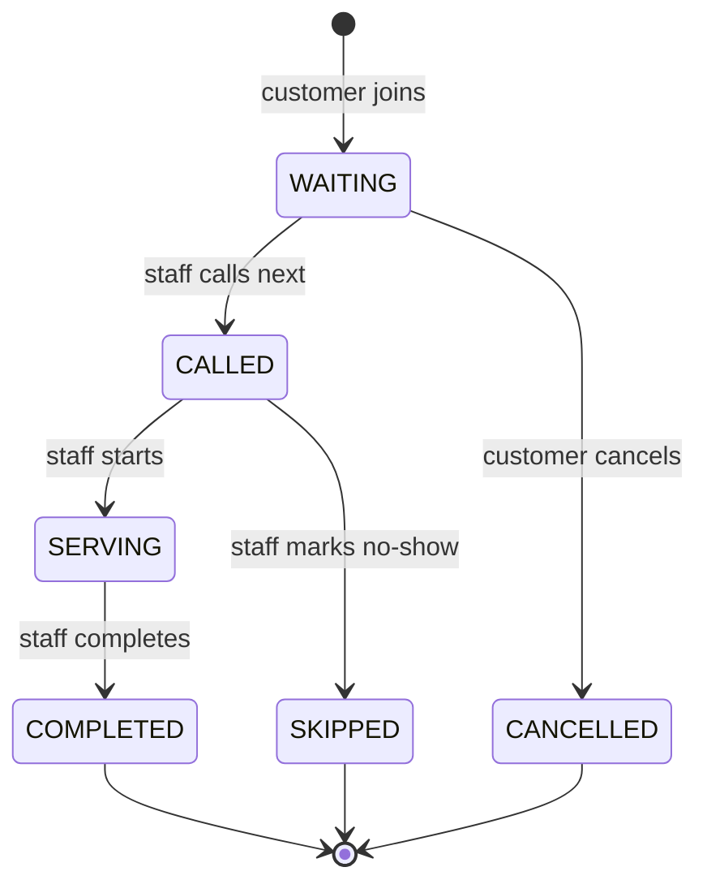
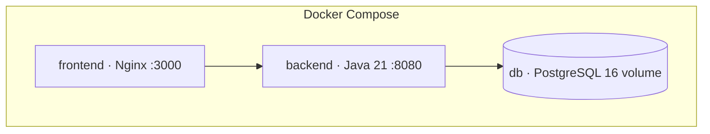

# LinePilot Architecture

## System context



There is one deployable backend and one database. The frontend is a static bundle served by Nginx, which also proxies API and SSE traffic. This boundary is enough to demonstrate integration without creating service-to-service failure modes that the product does not need.

## Backend package responsibilities

| Package | Responsibility |
|---|---|
| `controller` | HTTP mapping, validation, status/Location headers, the logged-in staff name, and notifying live boards after a change commits. |
| `dto` | Immutable API contracts; JPA entities never cross the controller boundary. |
| `entity` | Relational mappings and token state-transition invariants. |
| `repository` | JPA queries, pagination, and the PostgreSQL locking query. |
| `service` | `QueueService` (all business logic, transactional), `WaitTimeEstimator`, and `QueueEventStream` (SSE subscribers). |
| `security` | Database-backed user loading, BCrypt, Basic authentication, URL authorization, and CORS. |
| `exception` | Turns exceptions into consistent JSON error responses (`ProblemDetail`). |
| `config` | Clock, OpenAPI, and idempotent local demo-data creation. |

## Customer join transaction

```mermaid
sequenceDiagram
    participant C as Customer
    participant Ctl as PublicQueueController
    participant Svc as QueueService
    participant Q as service_queues row
    participant T as queue_tokens
    participant SSE as QueueEventStream

    C->>Ctl: POST /queues/{id}/tokens
    Ctl->>Svc: joinQueue (transaction starts)
    Svc->>Q: SELECT ... FOR UPDATE
    Svc->>Q: reset daily sequence if needed; increment
    Svc->>T: INSERT WAITING token
    Svc-->>Ctl: commit, return token
    Ctl->>SSE: broadcast fresh snapshot
    Ctl-->>C: 201 Created + Location + token
```

Locking the queue row serializes daily number generation. The database uniqueness constraint on `(service_queue_id, service_date, sequence_number)` is the final defense if future code bypasses that service method.

## Concurrent call-next transaction

The critical query is deliberately PostgreSQL-specific:

```sql
SELECT *
FROM queue_tokens
WHERE service_queue_id = :queueId
  AND status = 'WAITING'
ORDER BY joined_at ASC, id ASC
FOR UPDATE SKIP LOCKED
LIMIT 1;
```



Why both `FOR UPDATE` and `SKIP LOCKED`:

- `FOR UPDATE` prevents another transaction from modifying the selected row until commit.
- `SKIP LOCKED` allows a second staff transaction to take the next eligible row instead of waiting for the first.
- If there is only one token, one transaction succeeds and the other receives a `409 Conflict`; it never receives the same token.
- The partial unique index on `claimed_by_id` for `CALLED`/`SERVING` states prevents one staff account from holding two active assignments, including race paths not caught by the pre-check.

This is not a distributed lock. It is ordinary transactional database concurrency in the system that owns the state.

## Token state machine



Entity methods reject invalid transitions and verify that the assigned staff member owns staff-only transitions. Services wrap each transition in a transaction and translate invalid current state into HTTP 409.

## Live update flow

1. A client opens `GET /api/queues/{id}/events`.
2. `QueueEventStream` stores its `SseEmitter` in a `ConcurrentHashMap` of `CopyOnWriteArrayList`s and immediately sends a snapshot.
3. A controller calls a `QueueService` write method. When it returns, the transaction has committed.
4. The controller loads a fresh snapshot and calls `QueueEventStream.broadcast`, so clients never see a change that later rolls back.
5. Timeout, disconnect, completion, and error callbacks remove the emitter.

SSE was chosen because the server initiates every live update. Compared with WebSocket/STOMP, it avoids a separate message protocol and client dependency. The tradeoff is that subscribers live in one process. This is acceptable because LinePilot intentionally runs one backend instance.

## Wait estimation

`WaitTimeEstimator` receives up to ten recent non-zero service durations measured from `serving_at` to `completed_at`. It rounds the average to minutes and multiplies by people ahead. If no completed sample exists, the queue’s configured fallback is used.

This estimate is intentionally explainable. It does not claim machine learning, forecasting, or capacity modeling.

## Security model

- Staff accounts are rows in `user_accounts`; passwords are BCrypt hashes.
- Spring Security loads accounts through `DatabaseUserDetailsService`; every account has the `STAFF` role.
- `/api/staff/**` and `/api/auth/me` require `STAFF`.
- Queue browsing, joining, tracking by opaque UUID, cancellation by opaque UUID, and SSE are public.
- The API is stateless and uses HTTP Basic for the local demo. Browser code keeps the Authorization value only in React memory and clears it on sign-out/reload.
- CSRF is disabled because credentials are supplied explicitly in an Authorization header rather than ambient cookies. Outside localhost, HTTPS is mandatory.

The public UUID is a possession secret, not customer authentication. That limitation is deliberate and documented.

## Failure handling

| Failure | API behavior |
|---|---|
| Unknown queue/token | 404 `ProblemDetail` |
| Closed queue join | 409 |
| No waiting token | 409 |
| Invalid lifecycle transition | 409 |
| Two requests change the same token at once (e.g. cancel vs. call) | 409 via the `@Version` check on `QueueToken` |
| Duplicate/constraint race | 409 without leaking SQL details |
| Bean validation failure | 400 with a field-error map |
| Missing/bad staff credentials | 401 |
| SSE disconnect/timeout | Emitter removed; browser EventSource reconnects |

## Index strategy

- Partial call-next index: queue, join time, and ID for waiting rows only.
- History index: queue plus descending join time for paginated staff history.
- Completed-service index: queue plus descending completion time for the ten-sample moving average.
- Unique daily token constraint: prevents number duplication.
- Unique active-staff partial index: prevents simultaneous active assignments for one staff member.

Indexes are tied to concrete queries; there is no speculative indexing.

## Deployment



Both database and backend have health checks, and dependent containers wait for healthy prerequisites. Flyway applies the schema before Hibernate validates it. All credentials/ports are environment-configurable.

## Intentionally absent

No microservices, gateway, Redis, Kafka, RabbitMQ, Kubernetes, distributed tracing, or metrics stack is present. None is needed for the learning objective. If multi-instance SSE becomes a real requirement, that single change would justify a shared event transport; it should not be added preemptively.
