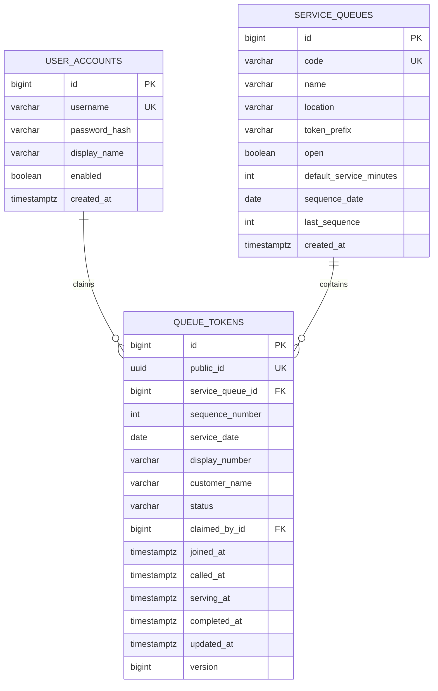

# Database and ER Diagram

## Entity relationship diagram



## Why only three tables?

The model follows the chosen scope:

- `service_queues` owns configuration and the locked daily sequence counter.
- `queue_tokens` is both the active queue and immutable-enough history; terminal rows remain for reporting and estimation.
- `user_accounts` represents authenticated staff. Customers do not need accounts in version one.

A separate history table would duplicate state and require event/audit synchronization. A separate counter table would add administration without changing the core claim invariant.

## Constraints

| Constraint | Purpose |
|---|---|
| `uk_user_accounts_username` | Stable unique login identity. |
| `uk_service_queues_code` | Human-readable queue identity. |
| `uk_queue_tokens_public_id` | Unguessable public tracking handle. |
| `uk_queue_tokens_daily_sequence` | One number per queue/day even if application logic regresses. |
| `ck_queue_tokens_status` | Reject unknown lifecycle values. |
| `uk_queue_tokens_active_staff_claim` | Partial unique index: one active `CALLED`/`SERVING` token per staff member. |

## Query-supporting indexes

```sql
-- Call-next order, restricted to rows the query can select.
CREATE INDEX idx_queue_tokens_call_next
ON queue_tokens (service_queue_id, joined_at, id)
WHERE status = 'WAITING';

-- Newest history first.
CREATE INDEX idx_queue_tokens_history
ON queue_tokens (service_queue_id, joined_at DESC);

-- Last ten completed services for wait estimation.
CREATE INDEX idx_queue_tokens_wait_estimate
ON queue_tokens (service_queue_id, completed_at DESC)
WHERE status = 'COMPLETED';
```

## Why `version` on `queue_tokens` only?

`service_queues` rows are only changed under a pessimistic lock (`SELECT … FOR UPDATE`), so they need no version column. `queue_tokens` rows can be changed by a customer (cancel) and a staff member (call) at the same moment; the `version` column lets Hibernate detect that and the API answers 409 instead of silently overwriting.

## Lifecycle timestamps

- `joined_at`: token creation.
- `called_at`: staff claim.
- `serving_at`: service actually begins.
- `completed_at`: terminal transition (`COMPLETED`, `SKIPPED`, or `CANCELLED`).
- `updated_at`: latest state change for clients/SSE.

The wait estimator uses `serving_at → completed_at`, not `joined_at → completed_at`, because queue wait and staff service duration are different measurements.
